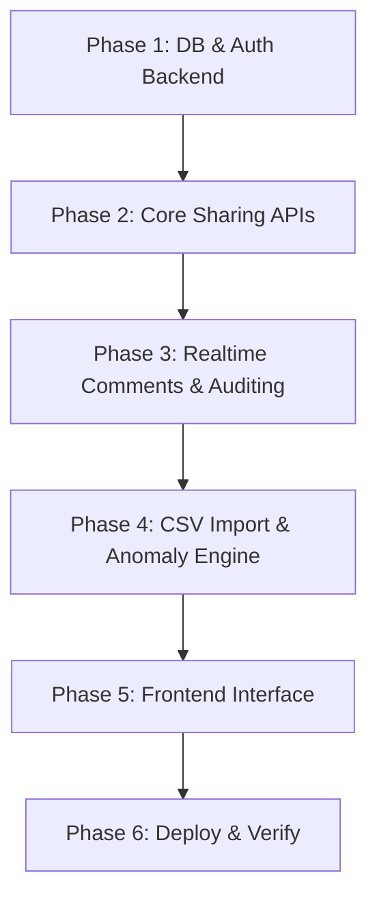

# Project Build Plan - Splitwise Clone MVP

This document outlines the step-by-step plan for building the Splitwise Clone MVP over a 3-day timeline. We will proceed incrementally, completing, testing, and confirming each phase before moving to the next.

---

## Roadmap Overview

---

## Phase 1: Database & Authentication Backend
- **Goals**: Set up database schemas, run migrations, write JWT authentication APIs, and verify user session flows.
- **Tasks**:
  1. Initialize Prisma schema inside `backend/prisma/schema.prisma` with defined PostgreSQL entities (`User`, `Group`, `GroupMembership`, `Expense`, `ExpenseSplit`, `Settlement`, `ExpenseComment`, `ImportBatch`, `ImportAnomaly`, `AuditLog`).
  2. Perform initial database migrations (`npx prisma migrate dev`).
  3. Create backend Express application structure.
  4. Write auth routes: `POST /api/auth/register` (password hashing with bcrypt) and `POST /api/auth/login` (generating JWT).
  5. Implement JWT verification middleware (`verifyToken`) for API route protection.
- **Tests**:
  - Unit/Integration tests for auth endpoints (successful signup, login, rejection of invalid tokens).

---

## Phase 2: Core Group, Expense, & Settlement APIs
- **Goals**: Implement expense splits, dynamic balance calculations, and settlement routes.
- **Tasks**:
  1. Build Group APIs: Create Group, Add Member (storing join dates), and Update Member (deactivating with leave dates).
  2. Implement Expense Creation API: Enforce timeline boundaries (user must be active during the expense date) and execute the Rounding Policy (adding remainder to payer).
  3. Implement Settlement API: Log peer-to-peer repayments and record immediately in database.
  4. Build dynamic balance utility: Fetch all expenses/splits and settlements for a group, compute net balance for each member, and run the greedy netting algorithm for peer-to-peer debt matrices.
  5. Expose balance retrieval endpoint: `GET /api/groups/:groupId/balances` showing net and peer-to-peer details.
- **Tests**:
  - Unit tests for Split Calculations (equal, unequal, percentage, share) and Rounding rules.
  - Unit tests for dynamic balance calculations (verifying math accuracy).
  - Integration tests for creating expenses and settlements and validating updated balances.

---

## Phase 3: Real-Time Chat & Audit Logging
- **Goals**: Setup Socket.IO for expense comments and write middleware to record audit logs.
- **Tasks**:
  1. Integrate Socket.IO into the Express server.
  2. Create Websocket event handlers to join room `expense_:id` and broadcast comments.
  3. Implement REST endpoints for fetching historical comments for an expense.
  4. Write an `AuditLogger` helper to insert records into the `AuditLogs` table on expense creation, editing, deletion, settlement logging, and CSV import resolutions.
- **Tests**:
  - Verify message broadcasting between socket clients.
  - Test that modifying an expense correctly triggers a database write to `AuditLogs`.

---

## Phase 4: CSV Import Engine & Anomaly Framework
- **Goals**: Implement CSV parsing, anomaly detection rules, and the resolution/commit endpoints.
- **Tasks**:
  1. Integrate a CSV parsing library (like `csv-parser` or `papaparse`) on the backend.
  2. Implement the parsing parser endpoint: `POST /api/groups/:groupId/import/upload`.
  3. Write the Anomaly Detection Engine executing:
     - Missing payer warnings
     - User casing normalization and alias discrepancy detection
     - Out-of-group user identification
     - Missing currency defaults
     - Settlement auto-detection
     - Duplicate transaction checking (similar title, same date/amount)
     - Negative refund formatting
     - Zero-value warnings
     - Percentage split sum validations
     - Date format fuzzy parsing
     - Group membership timeline compliance
  4. Save anomalies to `ImportAnomalies` table tied to an `ImportBatch`.
  5. Write resolver endpoint: `PUT /api/import/anomalies/:anomalyId/resolve` to store user-submitted corrections.
  6. Write final commit endpoint: `POST /api/import/batches/:batchId/commit` to batch-insert final parsed transactions.
- **Tests**:
  - Run test suites containing mock CSV strings representing each anomaly type.
  - Verify that the detection engine flags them with correct severity and descriptions.

---

## Phase 5: React Frontend Interface
- **Goals**: Build the 13 required pages/views with Vanilla CSS styling.
- **Tasks**:
  1. Build Auth pages (Login, Register).
  2. Implement Dashboard showing user-wide net summaries and group lists.
  3. Build Group Detail view showing expense feed, active member directories, and actions (Add, Settle, CSV).
  4. Build Expense Details view with dynamic split details and integrated Socket.IO comment chat.
  5. Construct the CSV Import landing, staging review grid (showing rows and error resolution fields), and post-import report dashboard.
  6. Style the entire web application using Vanilla CSS, prioritizing rich visual aesthetics (dark mode/glassmorphism design styles, clean fonts, micro-animations).
- **Tests**:
  - Verify client-side route protection.
  - Validate state management updates.

---

## Phase 6: Deployment & Scenario Verification
- **Goals**: Deploy applications to cloud environments and verify the target roommate scenario.
- **Tasks**:
  1. Provision PostgreSQL database on Neon.
  2. Deploy Express API backend on Render (configuring Socket.IO compatibility).
  3. Deploy React SPA frontend on Vercel.
  4. Perform the end-to-end roommate scenario: Upload the target `expenses_export.csv` file, resolve all anomalies, commit, and verify that the final balances screen output matches manual math calculations.
